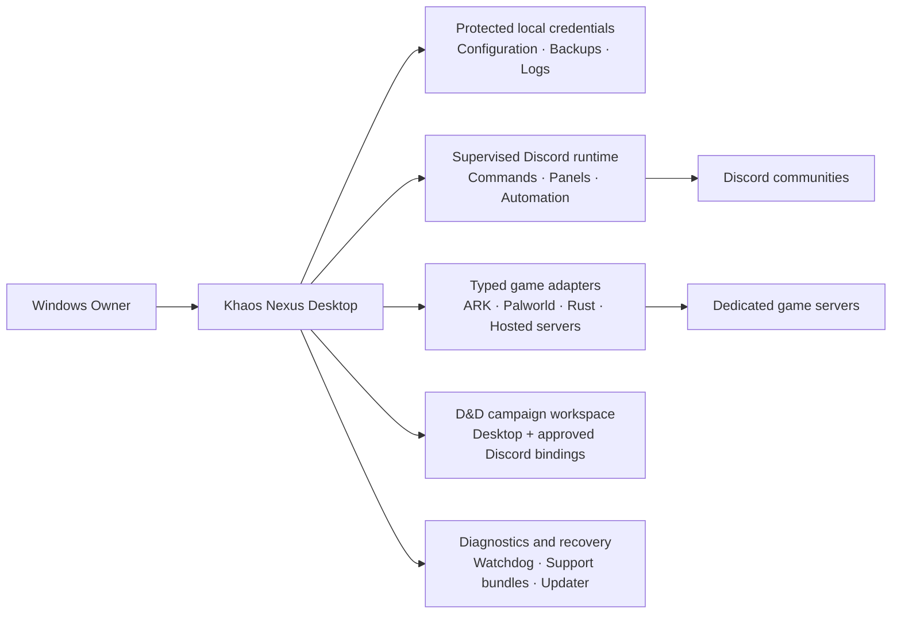

<div align="center">

# Khaos Nexus

### The local-first command center for Discord communities, dedicated game servers, and tabletop campaigns

[](../../releases/latest)
[](../../releases/tag/v0.26.0)
[](../../releases/tag/v0.26.5-beta)
[](#architecture)
[](#current-features)

**Command the chaos. Keep control local.**

One Windows application for Discord automation, multi-game server operations, D&D campaign management, diagnostics, protected updates, and recovery.

[Download the latest release](../../releases/latest) · [Explore features](#feature-highlights) · [Run from source](RUN_FROM_SOURCE.md) · [Security model](SECURITY.md)

</div>

---

## Why Khaos Nexus?

Most community tools solve one problem at a time. Khaos Nexus brings the operational pieces together without turning your infrastructure into someone else’s dashboard.

| Built for control | What that means |
| --- | --- |
| **Local-first operation** | Credentials, configuration, logs, backups, and runtime control stay on the Windows host. |
| **One command center** | Manage Discord bots, game servers, schedules, moderation, D&D campaigns, updates, and diagnostics from one application. |
| **Guarded automation** | Destructive actions use permissions, confirmations, bounded tokens, redaction, and audit history. |
| **Recoverable by design** | Startup guards, watchdogs, verified backups, support bundles, portable builds, and a standalone diagnostics launcher are part of the platform. |
| **Extensible architecture** | Typed adapters, module gates, registered Discord bots, and shared contracts let new capabilities join the Nexus without bypassing safety rules. |

> Khaos Nexus is an existing, actively developed desktop platform—not a hosted control panel, not a website wrapper, and not a collection of disconnected scripts.

## Feature Highlights

### Discord operations

Run and supervise Discord bots, register commands, build role and channel automation, publish persistent status panels, route logs, and keep public output free of protected server details.

### Game-server control

Operate ARK and generic RCON servers, Palworld REST/RCON, Rust WebRCON, Pterodactyl-hosted servers, cross-server moderation, recurring maintenance, save-before-shutdown workflows, and typed adapter capabilities.

### D&D campaign workspace

Manage campaigns, characters, members, sources, quests, sessions, attendance, encounters, initiative, world records, loot, homebrew, dice history, and registered-bot Discord bindings. The beta channel extends this with live maps, a structured NPC builder, character imports, verified free-content packs, and persistent Discord encounter panels.

### Reliability and recovery

Use mandatory pre-update backups, retained logs, startup health checks, software-renderer fallback, watchdog recovery, redacted support bundles, installer and portable builds, and the standalone Khaos Nexus Diagnostics runtime.

## Release Channels

| Channel | Current release | Intended use |
| --- | --- | --- |
| **Stable** | [`v0.26.0`](../../releases/tag/v0.26.0) | Recommended baseline for normal operation and validated production workflows. |
| **Beta** | [`v0.26.5-beta`](../../releases/tag/v0.26.5-beta) | Owner testing for the newest D&D content, maps, NPC, import, and encounter-panel features. |
| **Paused** | Android Companion / Mobile Gateway | Source and security work are preserved, but APK publication and gateway activation remain disabled under ADR-008. |

Beta builds are real Windows releases, but they may still require focused Owner validation before their features are promoted to stable.

## Quick Start

1. Open the [latest release](../../releases/latest).
2. Download the Windows installer or portable executable.
3. Launch Khaos Nexus and complete local setup for the modules you intend to use.
4. Add protected Discord, game-server, or hosting credentials through the desktop application.
5. Keep backups and update checks enabled so upgrades retain a verified recovery point.

Developers can use [`RUN_FROM_SOURCE.md`](RUN_FROM_SOURCE.md) for local setup and repository commands.

## Architecture



The desktop application remains the authoritative local runtime. Renderer code does not receive raw bot tokens, server passwords, hosting API keys, or unrestricted filesystem access.

---

<!-- CURRENT_FEATURES:START -->
## Current Features

Khaos Nexus currently includes **17 production-ready capabilities** across the desktop platform, Discord automation, game-server operations, and reliability tooling.

### Core Desktop Platform

<details>
<summary><strong>Local-First Desktop Command Center</strong> — Runs Khaos Nexus as a standalone Windows operations platform.</summary>

**Status:** Available

Brings Discord automation, game-server control, D&D campaign management, modules, updates, diagnostics, and local configuration into one desktop application. Sensitive values remain protected through Windows secure storage.

</details>

<details>
<summary><strong>Module Center and Local Recovery</strong> — Lets the local desktop owner enable, disable, recover, and safely gate application modules.</summary>

**Status:** Available

Includes dependency-aware module switching, Disable All, Safe Mode, validated-module recovery, migration notes, and local recovery controls that remain available when Discord is offline or misconfigured.

</details>

<details>
<summary><strong>Startup Guard, Watchdog, and Recovery</strong> — Detects failed or unresponsive launches and presents a usable recovery path.</summary>

**Status:** Available

Uses serialized startup, visible-interface health checks, renderer monitoring, retained watchdog state, software-renderer compatibility, and recovery diagnostics instead of leaving the application frozen.

</details>

<details>
<summary><strong>Windows Installer, Portable Build, and Updates</strong> — Ships installable and portable Windows builds with a protected update flow.</summary>

**Status:** Available

Supports installer and portable executables, updater metadata, checksums, mandatory pre-update backups, retryable installation, and an always-visible in-app update center.

</details>

### Discord Automation

<details>
<summary><strong>Supervised Discord Bot Runtime</strong> — Starts, monitors, configures, and recovers Discord bots from the desktop application.</summary>

**Status:** Available

Includes spawn-confirmed process supervision, slash-command support, live configuration updates, operator access controls, synchronized runtime status, and error reporting.

</details>

<details>
<summary><strong>Discord Studio and Server Automation</strong> — Builds and manages Discord-facing tools without manually recreating every server element.</summary>

**Status:** Available

Supports Discord Studio workflows, role menus, category and channel automation, module-aware commands and buttons, routed logs, and persistent server panels.

</details>

<details>
<summary><strong>Privacy-Safe Status and Queue Panels</strong> — Publishes persistent game-server information without exposing protected connection data.</summary>

**Status:** Available

Provides live server status, player summaries, queue information where supported, and refresh controls while excluding credentials, IP addresses, and platform identifiers from public output.

</details>

### Game Server Operations

<details>
<summary><strong>ARK and Generic RCON</strong> — Connects to ARK and other compatible servers through guarded RCON operations.</summary>

**Status:** Available

Supports status checks, announcements, player visibility, saves, moderation, schedules, and adapter-based command handling without exposing raw credentials to the interface.

</details>

<details>
<summary><strong>Palworld REST and RCON</strong> — Combines Palworld REST capabilities with RCON-backed administration.</summary>

**Status:** Available

Provides typed server status, connected-player operations, announcements, save and shutdown workflows, Discord delivery, and stable redacted adapter errors.

</details>

<details>
<summary><strong>Rust WebRCON</strong> — Adds dedicated Rust server administration through WebRCON.</summary>

**Status:** Available

Includes vanilla-safe status, players, saves, announcements, moderation, Discord status and queue panels, and Owner-only raw console access.

</details>

<details>
<summary><strong>Encrypted Pterodactyl Hosting Control</strong> — Controls hosted servers through the Pterodactyl Client API without exposing API keys to the renderer.</summary>

**Status:** Available

Discovers hosted servers, reads resource state, and provides guarded start, restart, stop, and Owner-confirmed emergency kill actions through encrypted credentials and short-lived action tokens.

</details>

<details>
<summary><strong>Cross-Server Players and Moderation</strong> — Shows connected players across selected servers and centralizes guarded moderation.</summary>

**Status:** Available

Supports game, server, and player search; reason-required kicks; Owner-confirmed bans; protected identifiers; local action history; and short-lived moderation tokens.

</details>

<details>
<summary><strong>Recurring Server Scheduler</strong> — Automates warnings, saves, shutdowns, restarts, and recovery checks.</summary>

**Status:** Available

Includes countdown broadcasts, save-before-shutdown protection, game-specific safe shutdowns, provider restart verification, cancellation, interrupted-job recovery, Discord reports, and execution history.

</details>

<details>
<summary><strong>Typed Game Adapter SDK</strong> — Provides a consistent extension layer for adding supported games.</summary>

**Status:** Available

Uses explicit capability manifests, guarded destructive-action policies, stable redacted errors, bounded protocol fixtures, and shared bridges for Palworld REST, ARK and generic RCON, and Rust WebRCON.

</details>

### Dungeons & Dragons

<details>
<summary><strong>D&D Campaign Workspace</strong> — Manages complete campaigns from the desktop app and approved Discord resources.</summary>

**Status:** Available

Stable workflows cover campaigns, members, sources, characters, quests, sessions, attendance, encounters, combatants, deterministic initiative, NPCs, locations, factions, loot, licensed content metadata, homebrew revisions, secure dice history, registered-bot grants, bindings, and persistent campaign panels.

</details>

### Diagnostics and Reliability

<details>
<summary><strong>Backups, Monitoring, and Support Bundles</strong> — Captures actionable diagnostics while keeping secrets out of logs and exports.</summary>

**Status:** Available

Includes verified local backups, rolling breadcrumbs, unclean-shutdown detection, retained AppData logs, stale-health cleanup, redacted support bundles, and optional HTTPS diagnostics delivery.

</details>

<details>
<summary><strong>Standalone Installer Diagnostics</strong> — Provides installer-first troubleshooting before the main interface has to load.</summary>

**Status:** Available

Includes the dedicated Khaos Nexus Diagnostics launcher, startup environment checks, portable sidecar reporting, offline guidance, support-bundle creation, and clearer recovery paths for installation or launch failures.

</details>

## In Development

These **5 capabilities** are actively being built or validated and are not yet presented as fully released features.

<details>
<summary><strong>Satisfactory Dedicated-Server Adapter</strong> — Extends the shared adapter system to Satisfactory's dedicated-server API.</summary>

**Status:** In development

Active validation covers typed server operations, capability reporting, safe administrative actions, and integration with the shared Nexus status and control surfaces.

</details>

<details>
<summary><strong>D&D Content Catalog and Character Imports</strong> — Adds verified free-content packs, Homebrew sources, and reviewable character imports.</summary>

**Status:** In development

The beta channel includes signed catalog validation, explicit Owner-controlled SRD package installation, source provenance, Khaos Nexus and generic JSON character imports, collision protection, and import review before saving.

</details>

<details>
<summary><strong>Live Campaign Maps</strong> — Adds uploaded or locally generated maps with persistent campaign markers.</summary>

**Status:** In development

The beta channel supports validated PNG, JPEG, and WebP uploads, deterministic local generation, pan and zoom, square or hex grids, party and campaign markers, GM-hidden data, normalized coordinates, and map snapshot export.

</details>

<details>
<summary><strong>Advanced NPC Builder and Encounter Integration</strong> — Expands NPC records into reusable narrative and combat-ready campaign tools.</summary>

**Status:** In development

The beta channel adds structured identity, personality, relationships, optional combat statistics, deterministic generation, import and export, reveal controls, encounter insertion, explicit stat synchronization, and featured-boss support.

</details>

<details>
<summary><strong>Persistent Discord Encounter Panels</strong> — Turns active encounters into live Discord combat panels with secure turn actions.</summary>

**Status:** In development

The beta channel adds one persistent message per encounter binding, boss and party health presentation, initiative updates, repairable panel records, DM-configured roll buttons, stale-action rejection, privacy enforcement, and audited DM controls.

</details>

## Paused

These **1 capabilities** are preserved but excluded from active production and release scope until an explicit architecture decision resumes them.

<details>
<summary><strong>Android Companion and Mobile Gateway</strong> — Preserved but excluded from active production and desktop release scope by Owner directive.</summary>

**Status:** Paused

Existing certificate-pinned HTTPS, Owner-approved pairing, signed-request, replay-protection, revocation, and Android Keystore work is preserved. APK publication, real-device testing, feature/toolchain repair, and Mobile Gateway activation remain prohibited until a new architecture decision explicitly resumes production.

</details>
<!-- CURRENT_FEATURES:END -->

---

## Downloads and Documentation

| Resource | Description |
| --- | --- |
| [Latest release](../../releases/latest) | Download the newest updater-visible Windows release. |
| [Stable v0.26.0](../../releases/tag/v0.26.0) | Use the current stable baseline. |
| [Beta v0.26.5-beta](../../releases/tag/v0.26.5-beta) | Test the newest D&D feature set. |
| [Run from source](RUN_FROM_SOURCE.md) | Install dependencies and launch a local development build. |
| [Security model](SECURITY.md) | Review credential storage, redaction, permissions, and protected actions. |
| [Pterodactyl setup](PTERODACTYL_SETUP.md) | Connect compatible hosted servers through the Pterodactyl Client API. |
| [Scheduler setup](SERVER_SCHEDULER_SETUP.md) | Configure warnings, saves, shutdowns, restarts, and verification. |
| [Owner test builds](TEST_BUILDS.md) | Review preserved validation checkpoints and test-build guidance. |
| [Android production hold](docs/ANDROID_PRODUCTION_HOLD.md) | Review the reversible Android and Mobile Gateway pause and resumption contract. |

## Security and Operational Safety

Khaos Nexus is designed to keep operational secrets away from public interfaces and renderer code.

- Discord tokens, provider credentials, server passwords, and device credentials are protected after storage.
- Public Discord messages exclude passwords, IP addresses, platform identifiers, and internal IDs unless a safe display value is explicitly required.
- Destructive operations use permission checks, short-lived internal tokens, reason requirements, and exact-target confirmation where appropriate.
- D&D player-safe projections exclude GM-only notes, hidden combatants, private rolls, and protected campaign data.
- Backups, logs, diagnostics, and support bundles are designed to redact sensitive values.
- Updates require a verified pre-update backup before installation proceeds.
- Android Companion and Mobile Gateway remain excluded from active releases while ADR-008 is in force.

See [`SECURITY.md`](SECURITY.md) for the complete security model.

## Windows Distribution

Published Windows releases may include:

- `Khaos-Nexus-Setup-<version>-x64.exe`
- `Khaos-Nexus-Portable-<version>-x64.exe`
- updater metadata and blockmaps
- SHA-256 checksum manifests

Release candidates remain gated by the relevant test suite, syntax and package checks, dependency audit, Windows packaging, diagnostics integration, updater-asset verification, and explicit Android/Mobile Gateway exclusion.

## Feature Documentation Registry

[`docs/features.json`](docs/features.json) is the machine-readable source for released, beta, paused, and planned capabilities. The README feature and roadmap blocks are generated from that registry so public documentation stays aligned with the application.

Update the registry, then synchronize:

```bash
node .github/scripts/sync-readme-features.mjs
```

Validate without changing the README:

```bash
node .github/scripts/sync-readme-features.mjs --check
```

The repository workflow also checks documentation consistency when application and release files change.

---

<!-- ROADMAP:START -->
## Planned Roadmap

The roadmap currently contains **5 planned capabilities**. Priorities may change as the desktop platform, Discord runtime, and game adapters mature.

<details>
<summary><strong>Unified Desktop Interface System</strong> — Consolidates the desktop and D&D interface into one responsive, accessible design system.</summary>

**Status:** Planned

The planned refresh will unify navigation, cards, forms, dialogs, status presentation, responsive behavior, keyboard access, Windows scaling, and D&D workspace layouts without replacing working application contracts.

</details>

<details>
<summary><strong>Release History and Safe Rollback</strong> — Adds a Settings-based release history with protected rollback controls.</summary>

**Status:** Planned

The planned update center will show the latest compatible Windows releases, distinguish beta and stable labels, create a verified backup, confirm the exact target, validate release assets, and record rollback history.

</details>

<details>
<summary><strong>Shared Bot Onboarding and Bring Your Own Bot</strong> — Makes one shared multi-server Nexus bot the default while preserving an advanced custom-bot path.</summary>

**Status:** Planned

The default onboarding flow will connect communities to the managed Nexus bot. Advanced users will be able to supply their own Discord application and token for separate branding or isolation.

</details>

<details>
<summary><strong>Remote D&D Player Experience</strong> — Explores a secure remote player view for approved campaign information and live maps.</summary>

**Status:** Planned

Any browser or remote-player experience requires a separate architecture decision for authentication, hosting, privacy, transport, and player-safe projections before implementation.

</details>

<details>
<summary><strong>Additional Game Adapters</strong> — Expands the Nexus through the typed adapter SDK as reliable server APIs become available.</summary>

**Status:** Planned

Future adapters will reuse the same capability, permission, status, scheduling, moderation, and redaction contracts instead of introducing one-off control paths.

</details>
<!-- ROADMAP:END -->

---

## Project Principles

- **Preserve working systems.** New features extend the existing application instead of replacing proven contracts.
- **Keep authority explicit.** Desktop, Discord, database, release, diagnostics, and adapter responsibilities remain separated.
- **Protect the Owner.** Credentials, destructive actions, updates, imports, and remote outputs use clear security boundaries.
- **Make failures actionable.** Logs, diagnostics, backups, and recovery paths should explain what happened and what can be done safely.
- **Ship evidence, not assumptions.** Releases are tied to exact commits, workflow results, artifacts, checksums, and rollback points.

## Contributing

Open an issue before material implementation, identify the exact scope owner, and preserve the repository’s coordination and validation requirements. Focused pull requests are preferred over broad rewrites.

For security-sensitive findings, follow [`SECURITY.md`](SECURITY.md) rather than posting credentials, private server data, or unredacted diagnostic bundles publicly.
